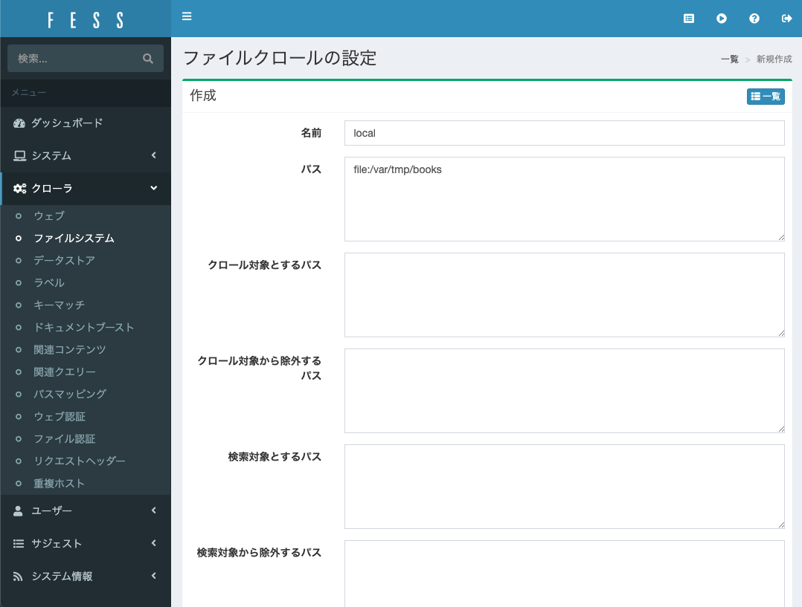

# Fess Sandbox

オープンソースの全文検索サーバである、FESSの検証リポジトリ

* https://fess.codelibs.org/ja/


## ビルド＆実行

`/book` ディレクトリに任意のPDF等を格納し、以下のコマンドを実行

```bash
$ docker-compose build
$ docker-compose up
```

`localhost:8080` にアクセスし、FESSのTOPページが表示されればOK


## ファイルクローリング

1.FESSのTOPページから「ログイン」をクリック。

2.ユーザ名とパスワードを入力して「ログイン」をクリック。  
* ユーザ名；admin
* パスワード；admin


3.メニューの「クローラ」＞「ファイルシステム」を選択。  


4.「新規作成」をクリック。  


5.「名前」には任意の値、「パス」には `file:/var/tmp/books` を入力して、一番下の「作成」クリック。


6.メニューの「クローラ」＞「ファイルシステム」を選択し、先ほど作成したクローラ名をクリック。  


7.一番下までスクロールし、「新しいジョブの作成」をクリック。  


8.「作成」をクリック。  


9.ジョブスケジューラ一覧画面に遷移するので、先ほど作成したスケジューラ名をクリックし、「今すぐ開始」をクリック。   


10.しばらく待って、TOPページから検索を行ってヒットすればOK。  


## 残件

- [ ] Elasticsearchをクラスタ化する